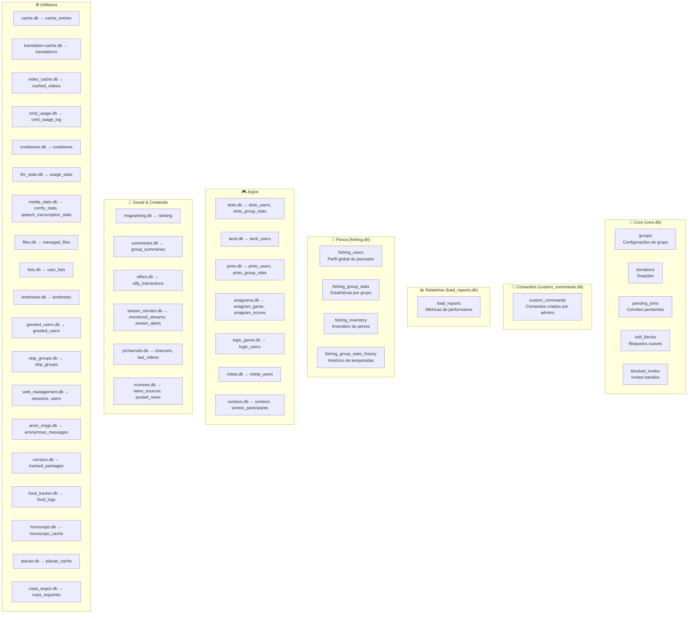

# DATABASE_TABLES.md

Mapa visual e descrição de todos os bancos de dados SQLite do sistema.
Localização: `data/sqlites/`

---

## Visão Geral

---

## 🧠 core.db

Banco central do bot. Gerenciado por `CoreRepository.js` via `better-sqlite3`.

### `groups`
Configuração completa de cada grupo onde o bot está presente.

| Coluna | Tipo | Descrição |
|---|---|---|
| `id` | TEXT PK | JID do grupo (ex: `120363...@g.us`) |
| `name` | TEXT | Nome sanitizado do grupo |
| `titulo` | TEXT | Título original do grupo no WhatsApp |
| `descricao` | TEXT | Descrição do grupo |
| `prefix` | TEXT | Prefixo de comandos (padrão: `!`) |
| `paused` | INTEGER | Bot pausado neste grupo (0/1) |
| `filters` | TEXT (JSON) | Filtros ativos: links, nsfw, palavras |
| `greetings` / `farewells` | TEXT (JSON) | Mensagens de entrada/saída |
| `interact` | TEXT (JSON) | Config de interação autônoma |
| `nicks` | TEXT (JSON) | Apelidos de membros |
| `warnings` | TEXT (JSON) | Advertências de membros |
| `custom_ai_prompt` | TEXT (JSON) | Personalidade da IA para o grupo |
| `muted_commands` | TEXT (JSON) | Comandos silenciados |
| `webhooks` | TEXT (JSON) | Webhooks configurados |
| `twitch` / `youtube` / `kick` | TEXT (JSON) | Canais monitorados |
| `json_data` | TEXT | **Legado** — mantido como fallback (Fase 4 remove) |

### `donations`
Registro de doações recebidas.

| Coluna | Tipo | Descrição |
|---|---|---|
| `name` | TEXT PK | Nome do doador |
| `valor` | REAL | Total acumulado doado (R$) |
| `numero` | TEXT | Telefone do doador |
| `timestamp` | INTEGER | Data da última doação (ms) |
| `historico` | TEXT (JSON) | Array de `{ts, valor}` por doação |

### `pending_joins`
Convites de grupo criados pelo bot aguardando uso.

| Coluna | Tipo | Descrição |
|---|---|---|
| `code` | TEXT PK | Código do convite |
| `author_id` | TEXT | JID de quem solicitou |
| `author_name` | TEXT | Nome de quem solicitou |
| `timestamp` | INTEGER | Data de criação (ms) |

### `soft_blocks`
Usuários com permissões restritas pelo operador.

| Coluna | Tipo | Descrição |
|---|---|---|
| `number` | TEXT PK | Número de telefone |
| `block_invites` | INTEGER | Bloquear envio de convites (0/1) |

### `blocked_invites`
Convites ou JIDs banidos permanentemente.

| Coluna | Tipo | Descrição |
|---|---|---|
| `id` | INTEGER PK | Auto-incremento |
| `code` | TEXT | Código do convite banido |
| `jid` | TEXT | JID banido |
| `timestamp` | INTEGER | Data do banimento (ms) |

### `local_blocks`
Números ou LIDs bloqueados localmente que o bot ignora completamente.

| Coluna | Tipo | Descrição |
|---|---|---|
| `number` | TEXT PK | Número de telefone ou LID (sem @c.us/@s.w.net) |
| `timestamp` | INTEGER | Data do bloqueio (ms) |

### `invite_history`
Histórico completo de convites de grupo recebidos pelo bot.

| Coluna | Tipo | Descrição |
|---|---|---|
| `id` | INTEGER PK | Auto-incremento |
| `invite_code` | TEXT | Código do convite do WhatsApp |
| `group_jid` | TEXT | JID do grupo associado (pode ser nulo) |
| `author_id` | TEXT | JID/número do solicitante do convite |
| `author_name` | TEXT | Nome/pushname do solicitante |
| `timestamp` | INTEGER | Data em que o convite foi enviado (ms) |
| `reason` | TEXT | Motivo fornecido para adicionar o bot |
| `json_data` | TEXT | Objeto JSON completo do convite |

### `group_membership_periods`
Histórico de estadias (períodos em que o bot entrou e saiu) de grupos.

| Coluna | Tipo | Descrição |
|---|---|---|
| `id` | INTEGER PK | Auto-incremento |
| `group_jid` | TEXT | JID do grupo associado |
| `group_name` | TEXT | Nome do grupo associado |
| `join_timestamp` | INTEGER | Data de entrada no grupo (ms, nulo se desconhecido) |
| `leave_timestamp` | INTEGER | Data de saída do grupo (ms, nulo se ainda estiver no grupo) |
| `duration` | INTEGER | Duração da estadia no grupo (ms, nulo se ainda ativo) |
| `join_responsible` | TEXT | Dados em JSON de quem adicionou o bot (nulo se desconhecido) |
| `leave_responsible` | TEXT | Dados em JSON de quem removeu o bot (nulo se ativo/desconhecido) |
| `json_data` | TEXT | Objeto JSON completo do período |

---

## 💬 custom_commands.db

Banco dedicado a comandos customizados criados por admins de grupos.

### `custom_commands`

| Coluna | Tipo | Descrição |
|---|---|---|
| `group_id` | TEXT PK | JID do grupo |
| `trigger` | TEXT PK | Texto que aciona o comando |
| `responses` | TEXT (JSON) | Array de respostas possíveis |
| `admin_only` | INTEGER | Só admins podem usar (0/1) |
| `active` | INTEGER | Comando ativo (0/1) |
| `deleted` | INTEGER | Soft-delete (0/1) |
| `count` | INTEGER | Número de usos |
| `last_used` | INTEGER | Último uso (ms) |
| `created_by` | TEXT | JID de quem criou |
| `created_at` | INTEGER | Data de criação (ms) |

---

## 📊 load_reports.db

Métricas de performance do bot por período.

### `load_reports`

| Coluna | Tipo | Descrição |
|---|---|---|
| `id` | INTEGER PK | Auto-incremento |
| `bot_id` | TEXT | ID do bot instância |
| `timestamp_start` | INTEGER | Início do período (ms) |
| `timestamp_end` | INTEGER | Fim do período (ms) |
| `duration` | REAL | Duração em segundos |
| `recv_private` / `recv_group` | INTEGER | Mensagens recebidas |
| `sent_private` / `sent_group` | INTEGER | Mensagens enviadas |
| `msgs_per_hour` | REAL | Throughput |
| `resp_avg` / `resp_max` | REAL | Tempo de resposta (ms) |
| `resp_count` | INTEGER | Amostras de tempo de resposta |

---

## 🎣 fishing.db

Jogo de pesca completo com temporadas por grupo.

### `fishing_users`
Perfil global do pescador (todas os grupos somados).

| Coluna | Tipo | Descrição |
|---|---|---|
| `user_id` | TEXT PK | JID do usuário |
| `name` | TEXT | Nome |
| `baits` | INTEGER | Iscas disponíveis |
| `total_weight` | REAL | Peso total pescado |
| `total_catches` | INTEGER | Total de pescarias |
| `best_fish_name` | TEXT | Nome do maior peixe |
| `best_fish_weight` | REAL | Peso do maior peixe |
| `best_fish_emoji` | TEXT | Emoji do maior peixe |

### `fishing_group_stats`
Estatísticas do pescador por grupo (temporada atual).

| Coluna | Tipo | Descrição |
|---|---|---|
| `group_id` | TEXT PK | JID do grupo |
| `user_id` | TEXT PK | JID do usuário |
| `catches` | INTEGER | Pescarias na temporada |
| `weight` | REAL | Peso na temporada |
| `best_fish_name` | TEXT | Maior peixe da temporada |

### `fishing_inventory`
Peixes individuais no inventário do usuário.

| Coluna | Tipo | Descrição |
|---|---|---|
| `user_id` | TEXT | JID do usuário |
| `name` | TEXT | Nome do peixe |
| `weight` | REAL | Peso (kg) |
| `is_rare` | INTEGER | Peixe raro (0/1) |
| `emoji` | TEXT | Emoji |
| `timestamp` | INTEGER | Data da pescaria (ms) |

### `fishing_group_stats_history`
Histórico de temporadas encerradas por grupo.

---

## 🎮 Jogos

### `slots.db`
Caça-níqueis. Tabelas: `slots_users` (perfil do jogador), `slots_group_stats` (ranking por grupo).

### `tarot.db`
Tarot. Tabela: `tarot_users` — histórico de leituras por usuário.

### `pinto.db`
Jogo do Pinto.

#### `pinto_scores`
Placar atual dos membros do grupo.

| Coluna | Tipo | Descrição |
|---|---|---|
| `group_id` | TEXT PK | JID do grupo |
| `user_id` | TEXT PK | JID do usuário |
| `user_name` | TEXT | Nome do usuário |
| `flaccid` | REAL | Comprimento flácido (cm) |
| `erect` | REAL | Comprimento ereto (cm) |
| `girth` | REAL | Circunferência (cm) |
| `curvature` | REAL | Curvatura (-30 a 30 graus) |
| `score` | INTEGER | Pontuação final |
| `last_updated` | INTEGER | Timestamp do último teste (ms) |

#### `pinto_history`
Histórico de todas as jogadas.

| Coluna | Tipo | Descrição |
|---|---|---|
| `id` | INTEGER PK | Auto-incremento |
| `group_id` | TEXT | JID do grupo |
| `user_id` | TEXT | JID do usuário |
| `user_name` | TEXT | Nome do usuário |
| `flaccid` | REAL | Comprimento flácido (cm) |
| `erect` | REAL | Comprimento ereto (cm) |
| `girth` | REAL | Circunferência (cm) |
| `curvature` | REAL | Curvatura (-30 a 30 graus) |
| `score` | INTEGER | Pontuação final |
| `timestamp` | INTEGER | Timestamp da jogada (ms) |

### `anagrama.db`
Jogo de anagramas. Tabelas: `anagram_game` (partidas ativas), `anagram_scores`.

### `logic_game.db`
Sequência lógica. Tabela: `logic_users` — pontuações.

### `roleta.db`
Roleta Russa. Tabela: `roleta_users` — histórico de sobrevivências.

### `sorteios.db`
Sorteios ativos e passados.

#### `sorteios`
Informações básicas dos sorteios.

| Coluna | Tipo | Descrição |
|---|---|---|
| `id` | INTEGER PK | Auto-incremento |
| `group_id` | TEXT | JID do grupo (ex: `120363...@g.us`) |
| `title` | TEXT | Título do sorteio |
| `message_id` | TEXT | ID da mensagem inicial do sorteio para controle de reações |
| `status` | TEXT | Status: 'active' ou 'finished' |
| `created_at` | INTEGER | Timestamp de criação |
| `winner_id` | TEXT | JID do vencedor |
| `winner_name` | TEXT | Nome do vencedor |
| `creator_id` | TEXT | JID de quem criou o sorteio |

#### `sorteio_participants`
Participantes inscritos em sorteios ativos.

| Coluna | Tipo | Descrição |
|---|---|---|
| `sorteio_id` | INTEGER | ID do sorteio (FK) |
| `user_id` | TEXT | JID do participante |
| `user_name` | TEXT | Nome do participante |
| `joined_at` | INTEGER | Timestamp de inscrição |

---

## 📣 Social & Conteúdo

### `msgranking.db → ranking`
Contador de mensagens por usuário/grupo para ranking de atividade.

### `summaries.db → group_summaries`
Resumos gerados por IA das conversas dos grupos.

### `sillies.db → silly_interactions`
Interações cômicas automáticas do bot.

### `stream_monitor.db`
- `monitored_streams` — canais Twitch/YouTube/Kick monitorados
- `stream_alerts` — histórico de alertas enviados

### `ytchannels.db`
- `channels` — canais YouTube inscritos por grupo
- `last_videos` — cache dos últimos vídeos detectados

### `munews.db`
- `news_sources` — fontes de notícias configuradas
- `posted_news` — notícias já postadas (evita duplicatas)

---

## ⚙️ Utilitários

| Banco | Tabelas | Uso |
|---|---|---|
| `cache.db` | `cache_entries` | Cache genérico chave-valor com TTL |
| `translation-cache.db` | `translations` | Cache de traduções para não re-chamar a API |
| `video_cache.db` | `cached_videos` | Cache de downloads de vídeo |
| `cmd_usage.db` | `cmd_usage_log` | Log de uso de comandos (analytics) |
| `cooldowns.db` | `cooldowns` | Rate limiting de comandos por usuário/grupo |
| `copa_seguir.db` | `copa_seguindo` | Chats que seguem times da Copa 2026 para notificações em tempo real |
| `llm_stats.db` | `usage_stats` | Tokens consumidos por modelo de IA |
| `media_stats.db` | `comfy_stats`, `speech_transcription_stats` | Uso de geração de imagem e transcrição |
| `files.db` | `managed_files` | Arquivos gerenciados pelo FileManager |
| `lists.db` | `user_lists` | Listas criadas por usuários nos grupos |
| `lembretes.db` | `lembretes` | Lembretes agendados por usuário |
| `greeted_users.db` | `greeted_users` | Controle de saudação (evita repetição) |
| `skip_groups.db` | `skip_groups` | Grupos excluídos de operações em lote |
| `web_management.db` | `sessions`, `users` | Autenticação do painel web |
| `anon_msgs.db` | `anonymous_messages` | Histórico de mensagens anônimas |
| `correios.db` | `tracked_packages` | Rastreamento de encomendas Correios |
| `food_tracker.db` | `food_logs` | Registro alimentar por usuário |
| `horoscopo.db` | `horoscopo_cache` | Cache de previsões astrológicas |
| `placas.db` | `placas_cache` | Cache de consultas de placas veiculares |
| `raffle_cache.db` | `raffle_cache` | Cache de informações e andamento de rifas/ações |
| `relacionamentos.db` | `relacionamentos` | Histórico e estatísticas de relacionamentos (namoros, casamentos, divórcios, traições e coisas) nos grupos |

### `relacionamentos.db`
Banco de dados para o módulo de relacionamentos nos grupos do WhatsApp.

#### `relacionamentos`
Armazena propostas e relacionamentos ativos ou terminados entre os participantes nos grupos.

| Coluna | Tipo | Descrição |
|---|---|---|
| `id` | INTEGER PK | Auto-incremento |
| `group_id` | TEXT | JID do grupo (ex: `120363...@g.us`) |
| `user1` | TEXT | JID do autor / proponente |
| `user2` | TEXT | JID da pessoa alvo |
| `tipo` | TEXT | Tipo de relacionamento: 'namoro', 'casamento', ou 'separar' (pedido de separação) |
| `status` | TEXT | Estado do relacionamento: 'pendente', 'ativo' ou 'terminado' |
| `criado_em` | INTEGER | Timestamp de criação/ativação do relacionamento |
| `terminado_em` | INTEGER | Timestamp de término (separação) |
| `coisas_count` | INTEGER | Contador de quantas vezes o casal coisou |
| `traicoes_count` | INTEGER | Contador de quantas vezes o autor traiu o cônjuge / parceiros |
