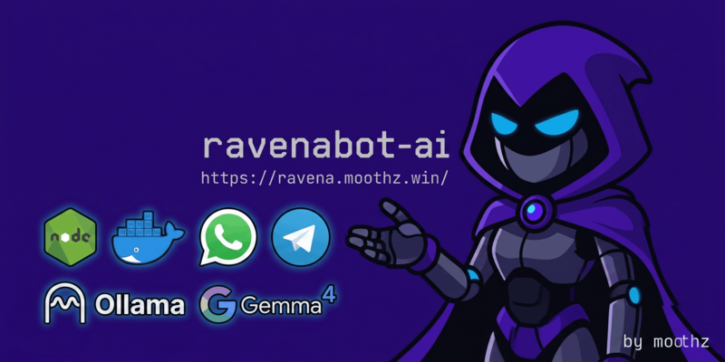

# RavenaBot AI



> Novo código da ravena completamente desenvolvido utilizando LLMs como Claude 3.7, 4.6 Sonnet e Gemini 2.5, 3.1 Pro. Esta versão remove o suporte para o wwebjs e foca em uma API REST com o backend em whatsmeow, tudo via **docker**, _sem perrengues!_.

## 🔮 Visão Geral

RavenaBot é um bot para WhatsApp que vem sendo desenvolvido desde 2021, apenas como uma brincadeira/hobby. Começou como um bot da twitch (pra aprender um pouco da API deles com python) e depois foi integrado ao WhatsApp (pra aprender sobre nodejs) - virando um _spaghetti code_ absurdo, aí veio a ideia de refazer todo o código do zero, mas com uma ajudinha especial dos LLM (pra ver o estado atual de criação de código assistido por IA).
O foco deste bot é a utilização do mesmo em grupos, onde ele pode notificar status das lives, responder comandos com utilidades (!clima, !gpt, ..,), criar comandos personalizados do grupo (como nightbot, StreamElements, etc.).

Após muitas versões e adaptações, chegamos na versão atual - tudo concentrado em um docker compose simples de usar e escalável.

⚠️ **Atenção**: Bots deste tipo ***não são permitidos*** no whatsapp, então não use em seu número principal - compre um chip só pra isso.

## 🐦‍⬛ Quero usar agora!

Se você quer interagir com o bot e testar ele, eu disponibilizo o mesmo _gratuitamente_ em alguns números, você pode conferir o status dos bots [aqui neste link](https://ravena.moothz.win/)

- **Discord Bot**: Adicione a ravena no seu servidor [através deste link](https://discord.com/oauth2/authorize?client_id=1434519453416030369&permissions=5136918325222464&integration_type=0&scope=bot+applications.commands) _(BETA)_.
- **Telegram Bot**: Também dou suporte para o Telegram _(mas não muito)_, rodando o bot [ravenosabot](https://t.me/ravenosabot) e o grupo da [comunidade](https://t.me/+x242TMlPD4s2OTVh).

## 🛠️ Dependências e Funcionalidades

### 1. Funções Nativas (Prontas para uso via Docker)
Tudo isso aqui vem pronto e você não precisa configurar nada externo (utiliza binários pré-instalados como `ffmpeg`, `imagemagick`).
- **Figurinhas (Stickers):** Criação e conversão de figurinhas estáticas e animadas.
- **Downloaders:** Baixar vídeos e áudios do YouTube, TikTok, Instagram e mais (!download)
- **Jogos de Chat:** Pescaria, Pinto, Slots, Anagrama
- **Utilidades:** Gerador de QRCodes (pixs, wifi, URL), clima, notícias, lembretes
- **Gestão de Grupos:** Mensagens de boas-vindas, comandos personalizados, filtros de links, imagens NSFW e mais
- **Conversão de Arquivos:** Áudio (MP3/Opus), Vídeo para GIF e manipulação básica de imagens.

### 2. APIs Self-Hosted (Configuráveis no .env)
Se você quiser estas funcionalidades no bot, terá que hospedar estes serviços você mesmo e informar a URL nas configurações.
- **Inteligência Artificial:** Integração com Ollama, LM Studio ou AnythingLLM (Comandos de chat, OCR e resumos). _Dica: Pra pouco uso, é melhor usar uma IA grátis na nuvem como o Gemini Flash._
- **Voz e Transcrição:** Suporte a Whisper API (Transcrição automática) e [F5-TTS](https://github.com/SWivid/F5-TTS) via [docker moothz/f5-tts](https://github.com/moothz/f5-tts) (Sintetização de vozes personalizadas).
- **Jogos:** Stop, Tarô e outros jogos usam LLM para funcionar

### 3. APIs Externas (Token no .env)
Pra essas coisas, você vai precisar de cadastrar nos sites e informar sua chave de API (são grátis).
- **Plataformas:** Telegram e Discord (praticamente zero testes).
- **IA na Nuvem:** OpenAI, Google Gemini, Anthropic e Groq.
- **Monitoramento e Social:** Twitch (avisos de live), Last.fm, Giphy e NASA.
- **Games:** Riot Games (LoL/WR), Steam e PSN.
- **Utilidades:** IMDb e Rastreio de Correios.

### 4. APIs Estritamente Pagas
- **Consulta de Veículos:** O comando de consulta de placas (!placa) requer uma API paga específica (apiplacas).


## 💾 Docker Stack

A stack é composta por 5 containers:

- **ravena-ai**: O "cérebro" do bot. Aplicação Node.js que processa a lógica, comandos, jogos e integrações - a ravena que você já conhece.
- **whatsgoapi**: A ponte REST API desenvolvida em Go ([whatsmeow](https://github.com/tulir/whatsmeow)). Responsável pela conexão direta com o WhatsApp, garantindo velocidade e estabilidade sem delays.
- **rembg**: Serviço de inteligência artificial especializado em remoção de fundo de imagens. Utilizado pelos comandos `!removebg` e `!stickerbg` para gerar PNGs e figurinhas transparentes de alta qualidade instantaneamente.
- **postgres**: Banco de dados PostgreSQL utilizado para gerenciar as sessões da API e persistência de dados.
- **minio**: Storage de objetos (S3 compatible) para armazenamento e cache de mídias (imagens, vídeos, áudios).
- **health-check**: Monitora a saúde dos serviços e reinicia os containers automaticamente em caso de falha.


## 🚀 Recursos Principais

- **Básico de Mídia** - Stickers, stickers sem fundo, baixa vídeos/música do youtube, baixa gifs, imagens, converte formatos, muda volume e mais!
- **Sistema modular de Comandos** - Comandos fixos implementados por arquivo que todos podem ajudar a expandir + Interpretador comandos personalizados que podem ser cirados em tempo real dentro dos grupos
- **Plataformas de Streaming** - Monitoramento de Twitch, Kick e YouTube com notificações customizáveis dentro dos grupos
- **Jogos** - Roleta russa, pescaria, pokemon, geoguesser... Tudo isso no chat do grupo
- **Zoeira** - Comandos de zueira pra entreter os memrbos
- **Interações no Grupo** - Mensagens de boas vindas, despedidas, resumo de conversas, interações inteligentes
- **Integração com LLMs** - Código pronto pra utilizar APIs OpenRouter, Gemini, ChatGPT e locais com o LMStudio
- **StableDiffusion** - Gera imagens via sdwebui e envia direto no whats, rodando local sem pagar APIs
- **Filtros de Mensagens** - Apaga mensagens com palavras específicas, links e também detecta conteúdo 18+
- **Sistema de Convites** - O bot processa links de convites e possui comandos para que o administrador coloque o bot nos grupos de forma remota
- **Painel de Controle Web** - Possui um painel de controle web (!g-painel) para configurar as opções do grupo
- **Multiplas instâncias** - Múltiplos bots rodam com o mesmo código, compartilhando a base de dados
- **Gerenciamento de Grupos**: Ferramentas para administradores
- **Sistema de Convites**: Controle quem pode adicionar o bot a grupos
- **Interações Automáticas**: O bot pode interagir aleatoriamente com mensagens

## 🔧 Como hospedar sua própria ravena

Se você não entende nada de programação ou nunca rodou aplicativos via código fonte, o melhor mesmo é chamar seu amigo da TI pra dar aquele help.

> **Requisito único:** [Docker](https://docs.docker.com/engine/install/) e [Docker Compose](https://docs.docker.com/compose/install/) instalados na máquina.

---

### Passo a passo

#### 1. Clone o repositório (com submódulos)
```bash
git clone --recurse-submodules https://github.com/moothz/ravena-ai.git
cd ravena-ai
```

Se tiver feito o clone sem o `recurse-submodules`, inicialize dentro da pasta do projeto manualmente:
```bash
git submodule update --init --recursive
```


#### 2. Gere o `.env` com segredos automáticos
```bash
make setup
```
Isso cria o `.env` a partir do `.env.example` e preenche automaticamente `GLOBAL_API_KEY`, `POSTGRES_PASSWORD` e `MINIO_SECRET_KEY` com valores aleatórios seguros.

#### 3. Configure o `.env`
Abra o `.env` e preencha pelo menos:

| Variável | O que é |
|----------|---------|
| `SUPER_ADMINS` | Seu número do WhatsApp no formato `5511999999999@c.us` |
| `BOTAPI_USER` / `BOTAPI_PASSWORD` | Credenciais para o painel web de gerenciamento |
| `DL_FOLDER` | Caminho no **host** para armazenar downloads (YouTube, Stickers, Imagens, etc). Use uma pasta com bastante espaço, por exemplo `/mnt/hd-externo/downloads` |
| `BOT_DOMAIN` | URL pública do bot (opcional, só necessário se quiser links externos funcionando) |

O resto é opcional — configure apenas as APIs que você quiser usar (Twitch, Gemini, OpenAI, etc).

#### 4. Configure os bots (`bots.json`)
```bash
cp bots.json.example bots.json
```
Edite o `bots.json` e adicione cada instância de bot que você quer rodar:

```json
[
  {
    "enabled": true,
    "nome": "meu-bot",
    "managementUser": "ravuser",
    "managementPW": "ravpw",
    "numero": "5511999999999",
    "customPrefix": "!",
    "ignorePV": false,
    "ignoreInvites": true
  }
]
```

> 💡 **Dica:** Editou o `bots.json`?
> ```bash
> make restart-bot
> # ou: docker compose restart ravena-ai
> ```

> Editou o `.env`?
> ```bash
> make up
> # ou: docker compose up -d
> ```

> Editou o código fonte (ex: functions)?
> 
> * **Método com Volumes (Recomendado):** Descomente as linhas de volumes de código em `docker-compose.yml` (`./index.js` e `./src`) para refletir as alterações no container instantaneamente, e aplique com:
>   ```bash
>   make restart-bot
>   ```
> * **Método Interativo:** Copie arquivos novos/editados para o container sem precisar de volumes e sem rebuild:
>   ```bash
>   make sync
>   ```
> * **Método Tradicional:** Se alterou dependências (`package.json`) ou deseja recriar a imagem (usando cache de camadas via BuildKit):
>   ```bash
>   make ravena-ai
>   ```


#### 5. Configure os provedores de API (`service-providers.json`)
```bash
cp service-providers.json.example service-providers.json
```
Este arquivo define as URLs das APIs self-hosted e externos (Whisper, Ollama, F5-TTS, Gemini, OpenAI, etc). Se você não usa nenhuma, pode usar um vazio assim:

```json
{
  "llm": [],
  "whisper": [],
  "comfyui": [],
  "sdwebui": [],
  "f5tts": []
}
```

```json
[
  { "type": "whisper", "url": "http://meu-servidor:5000" },
  { "type": "f5tts", "url": "http://meu-servidor:5050", "apiKey": "sua-chave-aqui" }
]
```

> Assim como o `bots.json`, basta `make restart-bot` para recarregar após edições.

#### 6. Suba os containers
```bash
make up-build
```
Isso constrói as imagens e sobe todos os serviços (`ravena-ai`, `whatsgoapi`, `postgres`, `minio`, `health-check`).

#### 7. Conecte o bot ao WhatsApp

Acesse o painel da `ravenabot` para escanear o QR Code ou gerar um código de pareamento, conforme o nome do seu bot definido no `bots.json`

**URL de exemplo:**

```
http://localhost:5000/qrcode/meu-bot
```
O login e senha são os valores definidos em `managementUser` e `managementPW` no `bots.josn`.

### 🌐 Fallback Proxy (Evitar erro 502 do Cloudflare)

Quando o bot está reiniciando ou em manutenção, as conexões diretas na porta pública falham e o Cloudflare exibe a tela de erro 502 padrão. Para contornar isso sem precisar de uma conta paga na Cloudflare, foi criado um proxy local em Node.js (gerenciado via **PM2**).

O proxy escuta na porta pública **`5000`** e encaminha o tráfego de forma transparente para a porta **`5001`** (onde o contêiner do bot `ravena-ai` agora roda). Caso o bot caia, o proxy intercepta o erro e renderiza uma página de status estilizada com o motivo da indisponibilidade.

#### Como iniciar o Proxy:
O proxy roda diretamente no host utilizando o PM2.
```bash
# Entre na pasta e inicialize pelo PM2
cd fallback-proxy
pm2 start ecosystem.config.json

# Para verificar se está rodando:
pm2 status

# Para ver os logs:
pm2 logs ravena-fallback-proxy
```

#### Motivo Dinâmico de Indisponibilidade:
* Os scripts do `Makefile` (ex: `make restart-bot`, `make ravena-ai`) escrevem automaticamente o motivo da indisponibilidade em `data/status_motivo.txt`.
* O **health-check** do Docker também escreve o motivo neste mesmo arquivo caso precise reiniciar o container devido a travamentos ou quedas inesperadas.
* Assim que o bot inicializa completamente e fica online, ele mesmo limpa o arquivo de motivo. A página do proxy fallback se recarrega sozinha assim que detecta o bot ativo.

---

### Comandos úteis

```bash
# === Inicialização e Configuração ===
make setup         # Configuração inicial (gera .env e segredos)
make up-build      # Build das imagens e sobe tudo
make up            # Sobe os containers sem rebuild
make down          # Para e remove os containers
make validate      # Valida a sintaxe do docker-compose.yml

# === Gerenciamento e Update ===
make restart-bot   # Reinicia o bot (aplicação instantânea com volumes de código ou bots.json)
make sync          # Sincroniza arquivos locais modificados/não rastreados com o container (sem rebuild)
make ravena-ai     # Reconstrói a imagem Docker e reinicia o bot (necessário ao mudar package.json ou se não usar volumes)
make restart-api   # Reinicia apenas o container da API (whatsgoapi)
make restart       # Reinicia todos os serviços (todos os containers)
make update-whatsgoapi # Atualiza o submódulo whatsgoapi e reconstrói o container

# === Monitoramento ===
make logs          # Logs de todos os containers
make logs-bot      # Logs apenas do bot
make logs-api      # Logs apenas do whatsgoapi
make ps            # Status de todos os containers

# === Testes e Desenvolvimento ===
make test          # Roda o harness de testes dentro do container (sem zap)
make test-quick FILE=path/to/file.js # Sincroniza um arquivo específico e roda o teste
make test-providers # Valida as chaves de API do service-providers.json

# === Manutenção ===
make update-allm   # Atualiza comandos na base do AnythingLLM
make clean         # Limpa containers parados e imagens órfãs
make clean-all     # PERIGO: Remove tudo (containers, imagens e VOLUMES)
```

### APIs Opcionais

Configure as chaves no `.env` conforme precisar:

* [Giphy](https://developers.giphy.com/) — Busca de GIFs (`GIPHY_API_KEY`)
* [OMDB](https://www.omdbapi.com/apikey.aspx) — Informações de filmes (`OMDB_API_KEY`)
* [Unsplash](https://unsplash.com/developers) — Busca de imagens (`UNSPLASH_API_KEY`)
* [Last.fm](https://www.last.fm/pt/api) — Perfis e histórico musical (`LASTFM_APIKEY`)
* [Riot Games](https://developer.riotgames.com/) — Estatísticas de LoL/WR (`RIOT_GAMES`)
* [Twitch](https://dev.twitch.tv/docs/api/) — Notificações de live (`TWITCH_CLIENT_ID` + `TWITCH_CLIENT_SECRET`)
* [Gemini](https://aistudio.google.com/api-keys) — IA na nuvem grátis (`GEMINI_API_KEY`)
* [OpenRouter](https://openrouter.ai/keys) — Acesso a múltiplos LLMs (`OPENROUTER_API_KEY`)


## 🧪 Testando sem WhatsApp

O bot possui um harness de testes que permite executar comandos dentro do container Docker **sem precisar de uma conexão WhatsApp real**. Ideal para desenvolvimento rápido.

### Fluxo de desenvolvimento

```bash
# 1. Edite o código localmente
vim src/functions/MeuComando.js

# 2. Copie o arquivo alterado para o container e rode os testes
make test-quick FILE=src/functions/MeuComando.js

# 3. Para rodar apenas os testes (sem copiar arquivos)
make test
```

### Como escrever testes

Edite o arquivo `run-testes.js` na raiz do projeto:

```javascript
const { msgTexto, msgMedia, msgComQuote, msgCustom } = require("./src/testing/helpers");
const TestRunner = require("./src/testing/TestRunner");

const GROUP_ID = "SEU_GROUP_ID@g.us"; // ID de um grupo real no banco

async function main() {
  const runner = new TestRunner({ groupId: GROUP_ID, author: "5511999@s.whatsapp.net" });

  // Mensagem de texto simples
  runner.run("!ping", () => msgTexto("!ping"));

  // Mensagem com mídia (carrega arquivo do disco)
  runner.run("!s - imagem", () =>
    msgMedia("!s", "./data/test-image.png", { type: "image" })
  );

  // Mensagem que responde outra (quoted)
  runner.run("!resumo com quoted", async () => {
    const quoted = msgTexto("Texto longo que precisa ser resumido.");
    return msgComQuote("!resumo", quoted);
  });

  // Objeto totalmente customizado
  runner.run("!help no privado", () =>
    msgCustom({ content: "!help", type: "text", group: null })
  );

  await runner.runAll();
}
main().catch(console.error);
```

### Helpers disponíveis

| Helper | Descrição |
|--------|-----------|
| `msgTexto(texto, opts?)` | Mensagem de texto simples |
| `msgMedia(legenda, arquivo, opts?)` | Mensagem com imagem/áudio/vídeo carregado do disco |
| `msgComQuote(texto, quoted, opts?)` | Mensagem que responde (cita) outra |
| `msgCustom(overrides)` | Objeto message totalmente customizado |

### Arquivos de mídia para testes

Coloque os arquivos na pasta `data/` com estes nomes:
- `data/test-image.png` e `data/test-image.jpg`
- `data/test-audio.mp3`
- `data/test-video.mp4`

### Como obter o ID do seu grupo

```bash
docker compose exec ravena-ai node -e "
  const DB = require('./src/utils/Database');
  DB.getInstance({ disableBackup: true }).getGroups()
    .then(gs => gs.forEach(g => console.log(g.name, '→', g.id)))
    .catch(console.error);
"
```

### Comportamento em modo de teste

- **Leituras**: normais — acessa o banco de dados real do container
- **Escritas**: bloqueadas — nenhum dado é alterado no banco
- **APIs externas**: ativas — comandos como `!yt`, `!ia`, `!img` fazem requests reais
- **Saída do processo**: automática — o runner fecha as conexões e encerra ao final

---

## 📝 Licença

Free, usem como quiserem.
