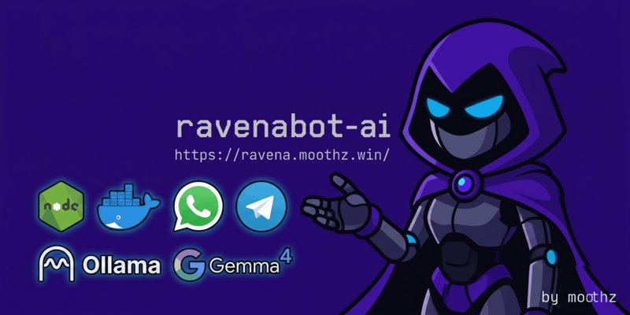

# RavenaBot AI



> Bot multifuncional para WhatsApp, Telegram e Discord, totalmente conteinerizado via **Docker** e construído com arquitetura modular, APIs modernas (whatsmeow / WhatsGoAPI) e integração nativa com Inteligência Artificial.

---

## 🔮 Sobre o Projeto

A **RavenaBot** foi desenvolvida para potencializar a dinâmica de grupos e canais:
- **Automação e Moderação:** Boas-vindas, despedidas, filtros de palavras, links e quarentena de conteúdo NSFW.
- **Mídia e Criação:** Geração de stickers estáticos e animados, conversão de formatos (áudio/vídeo/GIF) e download de plataformas (YouTube, TikTok, Instagram).
- **Gamificação e Coleção:** Sistema de harém/gacha (*Waifuletes*), pescaria de peixes lendários, cassino (slots/roleta) e jogos de palavras (anagrama/stop).
- **Streaming:** Notificações automáticas em tempo real de lives da Twitch, Kick e YouTube.
- **Inteligência Artificial:** Resumo de mensagens, transcrição de voz (Whisper/F5-TTS), OCR e respostas inteligentes via LLMs (Gemini, Claude, GPT, Ollama).

---

## 🤖 Dúvidas e Suporte com Agentes de IA

O repositório possui uma documentação técnica completa consolidada no arquivo:
👉 **[`docs/LLM-HELPER.md`](docs/LLM-HELPER.md)**

> [!TIP]
> **Como tirar dúvidas instantâneas sobre qualquer recurso:**
> 1. Baixe ou abra o arquivo [`docs/LLM-HELPER.md`](docs/LLM-HELPER.md).
> 2. Anexe-o como contexto em qualquer modelo de IA (ChatGPT, Claude, Gemini, AnythingLLM, OpenRouter).
> 3. Pergunte sobre qualquer comando, parâmetros, variáveis de comandos personalizados (`{API#...}`, `{mention}`) ou regras de configuração. A IA responderá como um especialista no código da Ravena.

---

## 🚀 Como Hospedar (Quickstart)

> **Requisito único:** [Docker](https://docs.docker.com/engine/install/) e [Docker Compose](https://docs.docker.com/compose/install/) instalados na máquina.

### 1. Clonar o repositório
```bash
git clone --recurse-submodules https://github.com/moothz/ravena-ai.git
cd ravena-ai
```

### 2. Configurar o ambiente
```bash
# Gera o arquivo .env inicial com segredos seguros
make setup

# Configura as instâncias de bots
cp bots.json.example bots.json

# (Opcional) Configura provedores adicionais de IA/Voz
cp service-providers.json.example service-providers.json
```
> Edite o `.env` para informar o número do seu WhatsApp em `SUPER_ADMINS` e defina os parâmetros do seu bot no `bots.json`.

### 3. Iniciar a aplicação
```bash
make up-build
```

### 4. Conectar ao WhatsApp
Acesse a interface web para ler o QR Code ou código de pareamento:
```
http://localhost:5001/qrcode/<nome-do-bot>
```
*(Utilize o usuário e senha definidos em `managementUser` e `managementPW` no `bots.json`)*.

---

## 🛠️ Comandos Rápidos do `Makefile`

| Comando | Descrição |
| :--- | :--- |
| `make up-build` | Constrói e inicializa todos os containers em segundo plano |
| `make up` | Inicia os containers existentes sem reconstruir imagens |
| `make down` | Para e remove todos os containers |
| `make restart-bot` | Reinicia apenas o container da Ravena |
| `make logs-bot` | Exibe os logs em tempo real do bot (`--tail 100`) |
| `make sync` | Sincroniza arquivos modificados no host diretamente para o container |
| `make test` | Executa o harness de testes automatizados com `FakeBot` no container |
| `make get-doador <termo>` | Consulta doadores cadastrados por nome ou número |
| `make clean` | Limpa containers parados, imagens antigas e cache de build |

---

## 📚 Documentação Técnica Adicional

- 📖 **[Manual de Comandos e IA (LLM-HELPER)](docs/LLM-HELPER.md)**: Relação exaustiva de mais de 70 módulos de comandos e variáveis personalizadas.
- 🤝 **[Guia de Contribuição e Testes](CONTRIBUTING.md)**: Padrões de código, ESLint e uso do harness `FakeBot` / `FakeMessage`.
- 🗄️ **[Estrutura de Banco de Dados](DATABASES.md)**: Mapeamento de tabelas SQLite e PostgreSQL.

---

## 📝 Licença

Distribuído sob licença livre. Sinta-se à vontade para utilizar, modificar e expandir.
